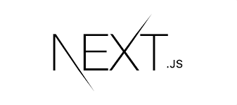

# Next.js Korea User Group

## Project
- [Next.js Docs 한글화](https://github.com/Nextjs-kr/Nextjs.kr/issues/1) (진행중)

## Maintainer
- [Changhyeon Yoon](https://github.com/ChanghyeonYoon)
- [JiHee Han](https://github.com/g2hhh2ee)
- [Jimin Yoo](https://github.com/yoo-jimin127)
- [Eunhye Jeon](https://github.com/haileyport)
- [Seunghyeong Lee](https://github.com/Samsam-lee)
- [Chaejun Lee](https://github.com/chaejunlee)

## Contributor
- [Yongmin Yoo](https://github.com/yymin1022)
- [Jeong Ha Seung](https://github.com/HA-SEUNG-JEONG)
- [Inkyu Kim](https://github.com/inkyu0103)
- [Conan Kunhwan Ahn](https://github.com/KunHwanAhn)
- [Dave](https://github.com/daveg7lee)
- [AhhyunLee](https://github.com/LAH1203)
- [milliwonkim](https://github.com/milliwonkim)
- [Jaeseok](https://github.com/Pridesd)
- [sumi.byun](https://github.com/sumi-0011)
- [Harry](https://github.com/haesoo-y)
- [Han ByoungJu](https://github.com/OneMoreBottlee)
- [Jeremy](https://github.com/Jeremy-Kr)
- [JeongMin](https://github.com/gyflsakfn)
- [JiHee Han](https://github.com/g2hhh2ee)
- [정서희](https://github.com/LireEruel)
- [KyungJi Kim](https://github.com/jqkk)
- [harry kim](https://github.com/hanyugeon)
- [Louie(Sumin Lee)](https://github.com/nimuseel)
- [Dongmin Ahn](https://github.com/eamon3481)
- [somin Lee](https://github.com/nimoseel)
- [SNUPI](https://github.com/joohaem)
- [HyeongKyeom Kim](https://github.com/Brokyeom)
- [정우병](https://github.com/woobottle)
- [김서진](https://github.com/SeojinSeojin)
- [Lee](https://github.com/de24world)
- [deokgoo](https://github.com/deokgoo)

